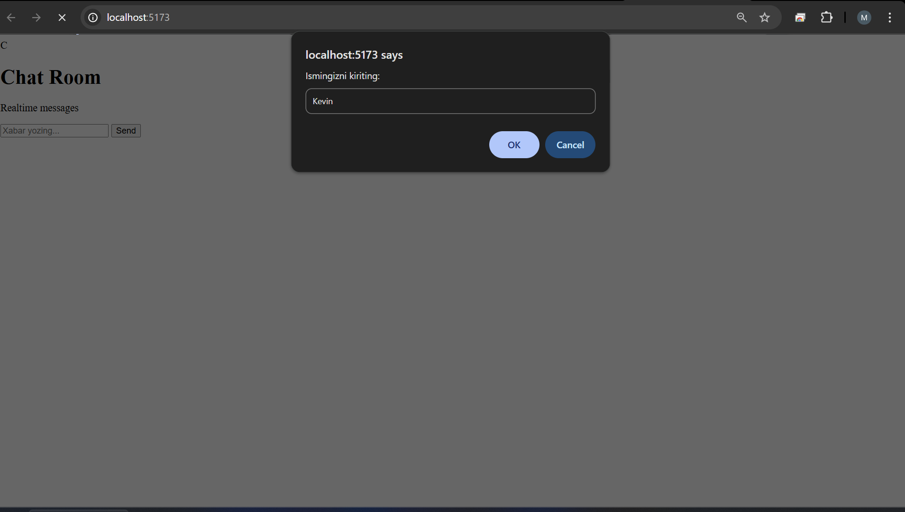
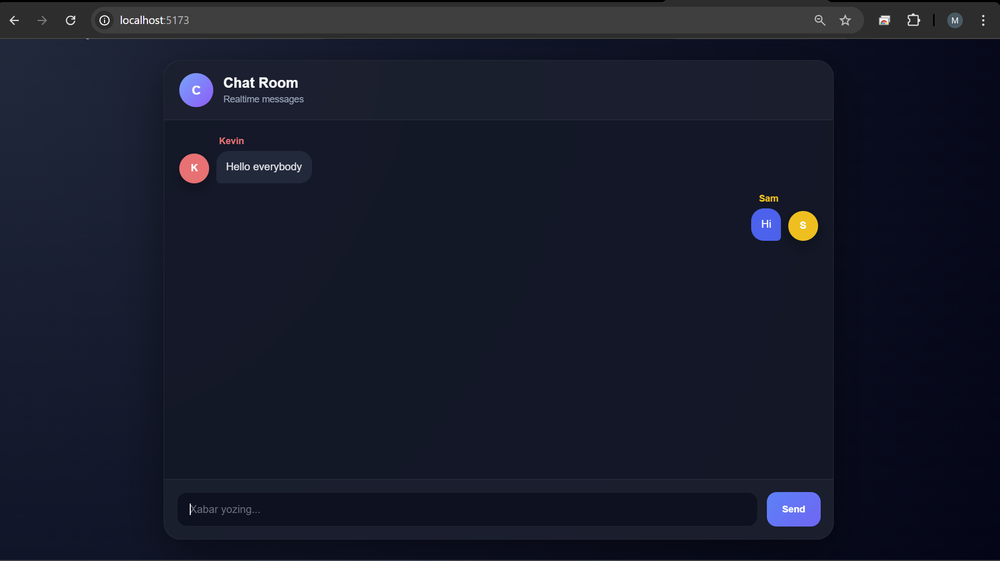
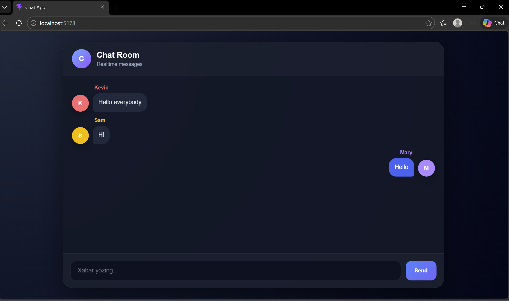

# Chat Box

A real-time chat application built with Socket.IO, featuring a monorepo architecture with separate web frontend and API backend.

## Screenshots


*Enter your name to join the chat*


*Real-time messaging with multiple users*


*Group chat in action*

## Introduction

Chat Box is a real-time messaging application that enables instant communication between users. Built with Socket.IO for WebSocket-based communication, it provides a fast and responsive chat experience. The project uses a monorepo structure with pnpm workspaces, separating the frontend (Vite) and backend (Node.js + Socket.IO) for better organization and scalability.

## How to Setup

### Prerequisites

- [Node.js](https://nodejs.org/) (v18 or higher recommended)
- [pnpm](https://pnpm.io/) package manager

### Installation

1. Clone the repository:
   ```bash
   git clone <repository-url>
   cd chat-box
   ```

2. Install dependencies:
   ```bash
   pnpm install
   ```

## How to Run

### Run All Services (Web + API)

```bash
pnpm dev
```

This command runs both the frontend and backend simultaneously using pnpm's parallel execution.

### Run Individual Services

**Run only the web frontend:**
```bash
pnpm dev:web
```

**Run only the API backend:**
```bash
pnpm dev:api
```

### Access the Application

- **Frontend:** Open your browser and navigate to `http://localhost:5173`
- **Backend:** The Socket.IO server runs on its configured port (check `apps/api/src/index.js`)

## Project Structure

```
chat-box/
├── apps/
│   ├── api/          # Backend Socket.IO server
│   │   └── src/
│   │       └── index.js
│   └── web/          # Frontend Vite application
│       ├── index.html
│       └── src/
├── package.json      # Root package.json with workspace scripts
└── pnpm-workspace.yaml
```

## Technologies Used

- **Frontend:** Vite, Socket.IO Client
- **Backend:** Node.js, Socket.IO
- **Package Manager:** pnpm (workspaces)
